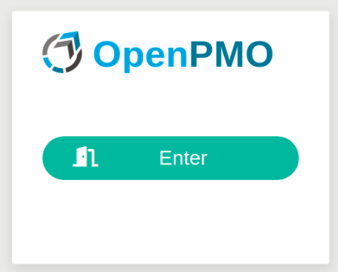

# openpmo-web

O produto é composto por 3 componentes:

* Frontend Angular, montado a partir do repositório no github
* Backend (Java Restfull API), montado com Gradle a partir do reposótior no github
* Banco de dados Neo4j, versão 3.5

Os componentes podem ser hospedados em um único servidor ou em servidores distintos.

O servidor que hospedar o Frontend requer a instalação e configuração de um servidor web http, como Apache ou Nginx.

Após o build do Frontend, o conteúdo da pasta "*dist*" deve ser copiado para a pasta de consumo (root directory) do servidor http.

Ainda no servidor http, deve ser criado um proxy para desviar as requisições direcionadas ao diretório virtual `/openpmo/` do servidor do
frontend para o diretório virtual `/openpmo/` do servidor do backend na porta 8080.

Assim: `<servidor do frontend>/openpmo/` para `<servidor do backend (api)>:8080/openpmo/`

O(s) servidor(es) que hospedar(em) o banco de dados e/ou o backend requerem a instalação do *Java JRE versão 8*.

A instalação do OpenPMO é configurável via arquivo de configuração para suportar qualquer sistema de autenticação padrão OAuth 2.0 OpenId Connect.

1. Twitter não é suportado por não usar `OAuth 2.0`.
2. São suportados sistemas `OAuth 2.0` compatíveis com *Google*, como *Acesso Cidadão*, *Facebook* e *Linkedin*.

Os usuários administradores do OpenPMO serão identificados em tempo de instalação via arquivo de configuração, que listará os usuários do sistema
de autenticação adotado que terão perfil *Administrator* naquela instalação do OpenPMO.

Toda pessoa que se logar no Open PMO e que não for "*Administrator*" terá o perfil "*User*" no OpenPMO.

O Open PMO não deve permitir a edição de campos informados pelo Serviço de Autenticação, mas deve manter tais informações em sua base de dados, para
efeito de histórico e consultas posteriores diretamente ao banco de dados.

O ícone e o rótulo do botão de login da interface (abaixo) também serão definidos na instalação via arquivo de configuração. Seguem instruções:



O arquivo configuração Front-End está localizado no caminho `src/app/assets/config/app-config.json`

#### Alterar ícone

Propriedade no arquivo de configuração é a "*authButtonIcon*".

O valor pode ser uma classe de icone do *Font Awesome*, por exemplo, "*fas fa-users*".

Pode também ser um caminho até o ícone, o ícone deve estar dentro da pasta "*assets*”. Tendo um ícone localizado no caminho `assets/icons/logo.svg` o
valor na configuração deve ser `icons/logo.svg`.

#### Alterar label

Como o projeto utiliza internalização é necessário informar o valor em `en-US` e `pt-BR`.

A propriedade no arquivo de configuração é a "*authButtonText*"

Informar o valor da tradução desejada conforme o valor na propriedade "*authButtonText*", por exemplo:

```
  "authButtonText": { "en-US": "Enter", "pt-BR": "Entrar" }
```
